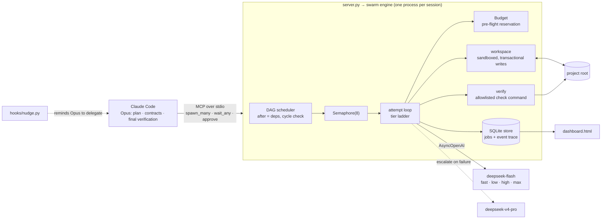
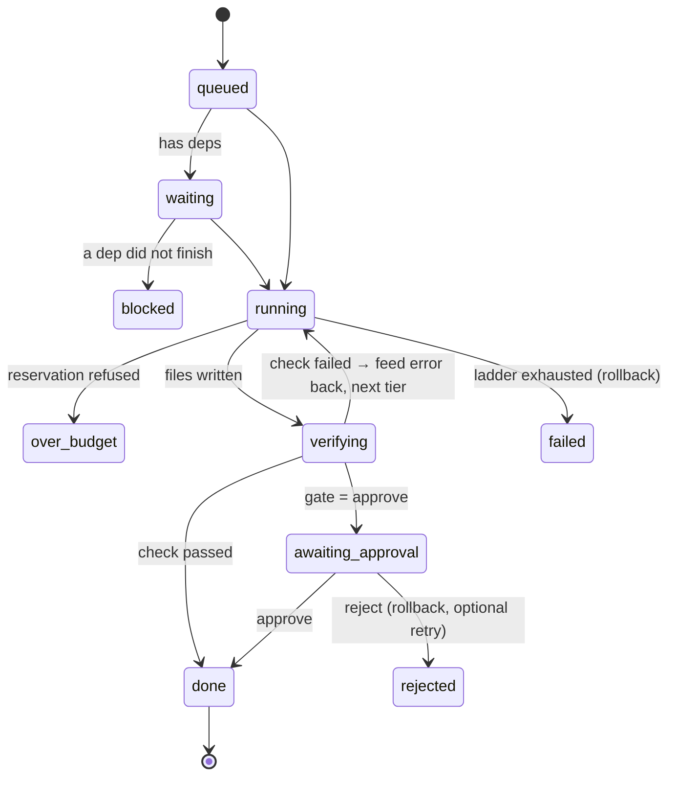

# Claude Subagents


A **bounded multi-agent engine** that lets Claude Code (Opus) delegate work to a swarm of cheap DeepSeek
workers, asynchronously, with the controls a production agent system needs: **model routing by cost and
quality, verify-and-repair loops, transactional rollback, cost budgets, human approval gates, a durable
event log, and an eval harness** that measures quality and cost per model tier instead of guessing.

Opus stays the architect and the verifier. Workers do the bounded typing: implementing files from a
contract, tests, boilerplate, bulk edits, long-document digestion, docs, content drafts.

**Measured, not assumed** (8 coding tasks with hidden tests, 3 repetitions, [full results](evals/RESULTS.md)):
the cheapest reasoning tier passed **24/24 at $0.0024 per passing run**, while the premium model passed 23/24 at
**7x the cost**. More reasoning did not buy quality on bounded work, so the routing ladders start cheap and
escalate only when a check fails. With escalation, 3 of the 4 runs that failed their first attempt were
rescued by a stronger tier; the fourth was rolled back cleanly.

## Architecture



### One job, end to end



1. **Submit.** `spawn_many` validates the whole batch first (paths, verify commands, labels, dependency
   cycles), then starts one `asyncio` task per job and returns ids in milliseconds. Claude keeps working.
2. **Schedule.** Jobs with `after` wait on their dependencies' completion events without holding a
   concurrency slot; a dependency's written files become the dependent's context automatically.
3. **Attempt.** Each attempt reserves its worst-case cost (estimated input + the tier's output reserve)
   against the session budget *before* calling the model, so parallel jobs can never overshoot it.
4. **Apply.** The worker's `=== FILE: path ===` blocks are written inside the project root. The original of
   every touched path is backed up first.
5. **Verify.** An allowlisted command (tests, typecheck, lint) runs in the project. On failure its output and
   the previous attempt are fed back and the job moves to the next tier of its ladder.
6. **Settle.** Pass → `done` (or `awaiting_approval` behind a human gate). Ladder exhausted → every write is
   rolled back, so a failed job never leaves broken files behind. Every step is an event in SQLite.

## Model routing

Profiles are narrowly scoped workers, each with its own prompt and **escalation ladder**, cheapest first:

| Profile | Owns | Ladder |
|---|---|---|
| `implement` | one file/unit against given interfaces | flash-low → flash-high → pro-high |
| `tests` | tests for existing code + spec | flash-high → pro-high |
| `review` | first-pass bug/security hunt | flash-max → pro-high |
| `bulk` | boilerplate, CRUD, schemas, fixtures, repetitive edits | flash-low → flash-high |
| `digest` | summarize/extract long material (1M context) | flash-fast → flash-low |
| `write` | docs, READMEs, scripts, translations | flash-fast → flash-high |

Tiers combine model, thinking on/off and reasoning effort, with prices from config (`swarm/config.py`).
The ladders are not guesses: they come from the eval below.

### Eval: quality x cost per tier

| Config | Pass (24 runs) | Hidden tests passed | Cost / passing run | Avg latency |
|---|---|---|---|---|
| flash-fast (no thinking) | 19 (79%) | 98.6% | $0.0009 | 1.8 s |
| **flash-low** | **24 (100%)** | 100% | **$0.0024** | 7.8 s |
| flash-high | 22 (92%) | 99.5% | $0.0073 | 22.1 s |
| flash-max | 21 (88%) | 99.3% | $0.0100 | 29.6 s |
| pro-high | 23 (96%) | 94.6% | $0.0171 | 39.8 s |
| ladder v1: high → max → pro, verify | 24 (100%) | 100% | $0.0053 | 18.9 s |
| **ladder v2: low → high → pro, verify** | 23 (96%) | 96.8% | **$0.0035** | 13.0 s |

Tier rows are pass@1: one attempt, no feedback. Ladder rows use the hidden tests as `verify`, so a failed
attempt gets the test output and moves up a tier. The first run changed my prior (I had started `implement` on
flash-high and put flash-max second); v2 is the data-driven ladder: 33% cheaper per passing run and faster, with
one run that failed on every tier including pro (a deliberately counter-intuitive slugify spec) and was rolled
back. With 24 runs per row, a one-run difference is noise; the robust findings are the cost gaps and that
max reasoning/premium did not beat the cheap tier here. Total spend for all eval runs: about $1.40.
Reproduce: `uv run python evals/run.py --ladder --repeat 3`.

## Controls

| Control | How |
|---|---|
| **Cost budget** | Per-session ceiling (`SWARM_BUDGET_USD`, `set_budget`). Pre-flight reservation of worst-case cost, settled with real usage. Refused attempts end as `over_budget`. |
| **Retries** | Bounded by the ladder (`max_attempts` to cap). Timeouts, rate limits and 5xx move to the next tier; auth, billing and bad-request errors (400/401/402/403) stop the job at once, since no other model can fix them; a worker saying `MISSING:` stops immediately, because a bigger model cannot invent missing context. |
| **Review gates** | `verify` = machine gate. `gate="approve"` = human gate: files wait on disk, `approve` keeps them, `reject` rolls back and can resubmit with feedback. Dependents wait for approval. |
| **State and memory** | Workers share state through files and written contracts, never through each other's context. Jobs and every event live in SQLite; `retry` works across restarts; stale jobs are marked `interrupted` on startup. |
| **Blast radius** | Reads/writes confined to the project root, no path traversal, secrets (`.env`, keys) never read or written, pre-existing files untouched without `overwrite`, verify commands are a single allowlisted program with no shell. |
| **Observability** | `trace(job)` = full event log (tier, tokens, cost, verify output per attempt). `stats` = success rate, first-try rate, escalations, cost per success, by profile and tier. `dashboard` = HTML report. |

## Example: a content pipeline on the same engine

[`examples/content_pipeline.py`](examples/content_pipeline.py) drives the engine as a library for a
short-form video channel: **strategy → N assembly-ready scripts (parallel) → packaging (titles, hooks,
hashtags, AI-disclosure flag) → compliance review**, with a human approval gate on the strategy and a hard
budget. A real run for 3 videos cost **$0.025** end to end ([sample output](examples/sample-output/)); the
compliance reviewer flagged claims that need sources and advice that needs a disclaimer before anything
could be published. Rendering and publishing are out of scope; the output folder is the hand-off.

```bash
uv run python examples/content_pipeline.py --niche "personal finance for college students" --videos 3 --budget 0.10
```

## Failure modes designed around

1. **Plausible but wrong output.** The cheap model's typical failure is code or tests that look right and
   aren't. Only work verifiable by execution is delegated, parallel workers share a written contract, each job
   can gate itself on a check, failures escalate with the error as feedback, and exhausted jobs roll back.
   Worker-written *tests* are wrong too sometimes: building this repo, the swarm produced an eval test that
   assumed NFKD turns `Æ` into `AE` (it doesn't), a test expecting a float the store rounds, and an engine
   test that exposed a real gap (a retried job couldn't replace its own earlier output). Reading the failing
   test before blaming the code is part of the loop.
2. **Orchestrator token cost.** Pasting code into prompts and re-typing results would spend Opus *output*
   tokens twice. The server reads `context_files` and writes results itself, returning `{path, status, lines}`.
3. **Async pitfalls.** A sync HTTP client inside `async def` silently serializes everything; a task without a
   strong reference can be garbage-collected mid-run; `asyncio.wait_for` cancels the job when the *caller's*
   wait times out. The engine holds every task, uses `AsyncOpenAI`, and waits with `asyncio.wait`.
4. **Runaway cost.** Budgets are enforced before the call, not discovered after it.
5. **Under-delegation.** An orchestrator that forgets its workers saves nothing: MCP server instructions,
   a global rule, skills, and hooks that fire on big prompts or after ~250 self-written lines.

## Why no orchestration framework

LangGraph, CrewAI and the agent SDKs are good when you need their graph runtime, persistence adapters or
hosted tracing. Here the orchestrator *is* an LLM (Claude Code) that already plans and calls tools, and the
worker side is a bounded DAG of single-shot calls with a verify loop. That fits in ~400 lines of asyncio with
no hidden control flow, every state change is an explicit event, and each failure mode above is handled in
code I can point to. I would reach for LangGraph or Temporal when jobs must survive process restarts
mid-flight, run across machines, or wait days on a human; see limits below.

## Quality

- `tests/` — 125 offline tests (fake LLM, no network): DAG, escalation, rollback, budget, gates, retries,
  sandboxing, store aggregates, verify allowlist. CI runs ruff + pytest on every push.
- `evals/` — 8 tasks with hidden tests, validated against reference solutions; `uv run python evals/run.py
  --ladder --repeat 3` regenerates [`evals/RESULTS.md`](evals/RESULTS.md).

## Setup

```bash
uv sync --group dev
cp .env.example .env    # DEEPSEEK_API_KEY, DEEPSEEK_BASE_URL
uv run pytest -q
claude mcp add subagents -s user -- uv run --directory "<repo path>" python server.py
```

Skills: link `skills/deepseek-swarm` and `skills/build-project` into `~/.claude/skills/`.
Hooks: register `hooks/nudge.py` for `UserPromptSubmit` and for `PostToolUse` on
`Write|Edit|MultiEdit|mcp__subagents__spawn|mcp__subagents__spawn_many|mcp__subagents__ask`.
Design contracts: [`docs/DESIGN.md`](docs/DESIGN.md).

## Known limits

- In-flight jobs die with the process (they are marked `interrupted` and can be retried). Surviving restarts
  mid-attempt, multiple workers across machines, or multi-day human waits would move scheduling to a durable
  engine (Temporal) and state to Postgres.
- `verify` executes worker-written code on the host. The allowlist prevents arbitrary shell from the tool call;
  it is not a sandbox. Untrusted workloads should run verification in a container.
- The eval set is small (8 tasks). It is enough to rank tiers and set ladders, not to make fine-grained claims.
